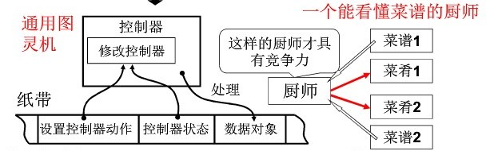

### 注：L1-L7是操作系统基础，涉及到汇编语言，太难了  :(  暂时跳过

****


# L1.什么是操作系统

## 是计算机硬件和应用之间的一层软件
- 方便我们使用硬件，如显示字符
- 高效实用软件，如打开多个终端/窗口

## 管理哪些硬件
- CPU管理
- 内存管理
- 终端管理
- 磁盘管理
- 文件管理
- 网络管理（暂时忽略）
- 电源管理（暂时忽略）
- 多核管理（暂时忽略）

# L2.“揭开钢琴的盖子”

## 从图灵机到通用图灵机
> 图灵机=>只会做一道菜的厨师  
> 通用图灵机=>能看懂菜谱的厨师
- 通用图灵机：  


## 从通用图灵机到计算机

- 冯诺依曼储存程序思想
- 计算机五大部件：
  - 输入设备
  - 输出设备
  - 存储器
  - 运算器
  - 控制器  


> 图中IP也可写为PC

- 程序从存储器中放入内存->取指执行->取指执行->......
  
## 打开电源，计算机执行的第一条指令？
- IP的值由硬件设计者决定  

> 1. x86:英特尔架构  
> 2. 实模式和保护模式对应，实模式的寻址CS:IP(CS左移4位+IP)与保护模式不一样   
> 3. CS:段寄存器  IP:偏移   
> 4. BIOS:basic input/output system  
> 5. ROM BIOS中的程序是固化的  
> 6. 第(5)步中读一个扇区(512字节)，0磁道0扇区是操作系统的引导扇区

## 0x7c00处的代码
- 引导扇区：启动设备的第一个扇区
- 启动设备信息被设置在CMOS(一种半导体，存储实时钟和硬件配置信息)

## 引导扇区代码：bootsect.s
> .s后缀：汇编。C语言编译后有无法控制的因素，所以用汇编


```
    mov ax, #BOOTSEG    mov ds, ax  ;此时ds=0x07c0
    mov ax, #INITSEG    mov es, ax  ;此时es=0x9000
    mov cx, #256
    sub si, si  sub di, di  ;实现段内偏移：ds和si接成一个地址0x7c00，es和di接成一个地址90000
    rep movw    ;移动256个字（512字节）：腾出空间
    jmpi go, INITSEG    ;将go赋值给IP，将INITSEG赋值给CS，此时CS=9000
```

```
    int 13  ;BIOS读磁盘的13号中断
            ;ah=0x02:从第二个扇区开始读
            ;al=4:读4个扇区
```

## 读入setup模块后：ok_load_setup

```
    int 0x10    ;BIOS10号中断：显示字符
    bp  ;待显示的字符在内存中位置
```


# L8.CPU的管理的直观想法

> 管理CPU=>多进程

## CPU工作原理
- 自动取值->执行(如：厨师看一眼菜谱干一步活)
1. 设置PC值，CPU发出PC值到总线
2. PC到达内存
3. 内存找到对应指令，传回CPU
4. CPU解释执行指令


## 管理CPU
- 设置好PC值就完事
- CPU自动依次取值->执行

## 发现问题
- 执行IO指令（如fprintf）时，程序执行远慢于计算指令

    相同条指令所需时间对比：

    |  计算  |  IO   |
    | :----: | :---: |
    | 10^6秒 |  1秒  |

- 执行IO时，CPU必须等待，故CPU利用率太低

## 解决
- 思路：别让CPU傻等，先让它干点别的去


## 多道程序，交替执行

> DEV:其他设备

## CPU如何面对多个程序
- 一个CPU上交替执行多个程序：**并发**
- 实现方法：适当的时候进行寄存器PC切换

## 修改寄存器PC的其他问题
- 切回原来程序的时候寄存器变了，原来的数据没了/被改了

- 解决方法：记录切换时程序的信息（如：看书时，换另一本书，那么第一本书需要书签记录读到哪里了）


## 进程
> 运行中的程序与静态程序（还没运行的程序）不一样，需要区分
- 运行中的程序：进程
- 进程与普通程序
  - 进程有开始、有结束，程序没有
  - 进程会走走停停，程序没有走停这一说法
  - 进程需要记录寄存器as、bx......，程序不用
- 多进程好


# L9.多进程

## 多进程使用CPU
> 进程ID：PID  
> 进程控制块：PCB  


- 操作系统负责把进程记录好，按照合理的次序推进（分配资源、进行调度）

## 多进程从启动开机到关机结束
- main中fork()创建第一个进程
  - ```if( !fork() ) { init(); }```
  - init执行了shell（Windows桌面）
- shell再启动其他进程
```c
int main(int argc, char *argv[])
{
    while(1)
    {
        scanf("%s",cmd); //用户输入一个命令

        if(!fork())
        {
            exec(cmd); //执行命令
        }

        wait();
    }
}
```
- 一个命令启动一个进程，返回shell再启动其他进程


## 多进程如何组织
> 全靠PCB  


- 执行进程（有一个同学正在打饭）
- 就绪队列（有一些同学正在排队）
- 等待队列（有一些同学没带饭卡：还需要其他事件，即使排到了也不能执行）  

## 多进程的组织 = PCB + 状态 + 队列
> 进程状态图  


# L10.用户级线程

## 多进程是操作系统的基本


## 是否可以资源（映射表->内存）不动而切换指令序列
- 进程 = 资源 + 指令执行序列
  - 将资源和指令执行分开
  - 一个资源 + 多个指令执行序列

- 线程：保留并发的优点，避免了线程切换代价（因为不需要切换映射表）
- 实质是映射表不变而PC指针改变

## 多个执行序列 + 一个地址空间是否实用
- 例子：一个浏览器
  - 一个线程接受服务器数据
  - 一个线程显示文本
  - 一个线程处理图片
  - 一个线程显示图片
- 线程共享资源

## 例子：浏览器
```c
void WebExplorer()
{
    char url[]="http://www.cms.hit.edu.cn"
    char buffer[1000];

    pthread_create(...,DetData,url,buffer);
    pthread_create(...,Show,buffer);
}

void GetData(chat* url, char* p){...};
void Show(char* p){...};
```


## yield和create
- yield目的：完成切换->核心
  - 了解切换时是个什么样子
- create：创造出第一次切换时的样子  


## 两个执行序列与一个栈


> 104：返回地址压栈
- 红色Yield：`jmp 204`
- B函数尾部的右大括号 `}`：相当于`ret`：弹栈->弹出404->发生错误
- =>两个序列一个栈会出错->用两个栈

## 两个执行序列与两个栈

- 把栈切回去->先存放栈：TCB（一个全局指针）
```c
void Yield()
{
    TCB1.esp = esp; //存esp
    esp = TCB2.esp; //切换栈
    // jmp 204; //和红色Yield()尾部的右大括号ret重复了，可以去掉
}
```

## 两个线程->两个TCB，两个栈，切换的PC在栈中


## 所有东西（浏览器）


## 用户级线程->Yield()是用户程序

- 用户级线程切换：操作系统感知不到切换
- 缺点：
  - 当用户程序接入系统内核（如网卡）时，一旦网卡阻塞，由于系统不知道用户线程，内核切换到别的进程，用户就卡了
  - 例子：
    - 用浏览器打开一堆网页（每个网页都是一个线程）
    - 如果网比较慢，一个网页导致网卡阻塞了
    - 于是操作系统从网卡进程切换到别的进程
    - 导致其他网页都没反应了

## 核心级线程->Schedule()：对用户不可见

- 优点：
  - 即使一个线程阻塞了
  - 操作系统也可以切换到其他线程


# L11.内核级线程 

## 开始核心级线程

> 目前多核使用较多  
> MMU：内存映射  
- 核心级线程->多核充分发挥作用

## 核心级线程与用户级线程
- ThreadCreate是系统调用，内核管理TCB和切换线程
- 内核栈
  - 两个栈（用户级）->两套栈（核心级）：既可以在用户栈里运行，又能在内核栈里运行
  - 一个TCB关联一个栈（用户级）->一个TCB关联一套栈（核心级）
- 关联
  - 进入内核的唯一方法：中断
  - 程序在用户栈中执行----*中断*---->进入内核栈

  - 用户栈的PC、CS压入内核栈
  - 通过指针，用户栈和内核栈关联成一套栈

## 分析


## 内核切换

> 接上一张图
- 执行sys_read()读磁盘，发生堵塞
- CPU通过```switch_to(cur, next)```找到下一个线程执行
  - ```cur```:当前线程TCB->蓝色ESP
  - ```next```:下一个线程TCB->红色ESP